author: Ariel Pohoryles
id: compare_google,_bing,_facebook,_linkedin,_and_x_ads_campaigns_with_snowflake_and_rivery
summary: Unlock powerful cross-channel analytics by effortlessly combining Google, Bing, Facebook, LinkedIn, and X Ads data in Snowflake using Rivery’s no-code data integration, transforming your marketing strategy with real-time insights and optimized budget allocation
categories: Getting-Started
environments: web
status: Draft
feedback link: https://github.com/Snowflake-Labs/sfguides/issues
tags: Getting Started, Data Science, Data Engineering, Rivery, Data Pipelines, Marketing Analytics

# Compare Google, Bing, Facebook, LinkedIn, and X Ads Campaigns with Snowflake & Rivery
<!-- ------------------------ -->
## Overview
Duration: 1

A large portion of most B2B marketing teams' budget goes toward digital Ads. This budget is often spread across multiple online advertising channels such as Google Ads, Bing Ads, YouTube Ads (aka paid search channels), Facebook Ads, LinkedIn Ads, and X Ads (aka paid social channels). This spread makes it hard to understand campaign performance across channels, before diving deeper into channel-specific optimizations. Optimizing your paid Ads strategy starts with finding the answers to questions like: 

- Which channel performs the best for which campaign? 
- What portion of my budget should be allocated towards which channel? 
- How effective are different campaigns when run on paid search vs. paid social? 

Getting these answers can be done manually in spreadsheets using a non-scalable, time-consuming process or by investing in a complex data integration project that requires extracting data from different sources, loading it into a centralized target, modeling it, and visualizing it. A project that can easily occupy a data team for a full quarter. With Snowflake and Rivery, this can be accomplished in minutes.

Using Rivery’s no-code integrations to all of those sources and a template workflow to join and model the data across B2B paid Ads sources your data will be ready for analysis within Snowflake in no time. Moreover, you can then use Rivery’s [200+ data source integrations](https://rivery.io/integration/) and further enrich your Snowflake data models with data from your CRM and product usage to get a complete view and increase your real return on ad spend (ROAS). 

In this lab, Marketing Analysts, BI Developers, and Data Engineers will learn how easily they can build a complete paid Ads performance analytics solution with Rivery and Snowflake.

### Prerequisites
- Access to an existing Snowflake account, or a [new Snowflake trial account](https://signup.snowflake.com/), with `SYSADMIN` role.
- OPTIONAL: User accounts to access Google Ads, Bing Ads, Facebook Ads, LinkedIn Ads, and X Ads. Since walking through this lab is quick and we assume you may not have these accounts handy while doing the lab, we provide you with sample data to run through the lab steps. You can always repeat the same steps with the real accounts of those sources.  


### What You’ll Learn 
In this lab, you will learn how to set up a data pipeline that orchestrates the integration of data from Google Ads (including YouTube Ads), Bing Ads, Facebook Ads (including Instagram Ads), LinkedIn Ads, and X Ads in Snowflake so the data is ready for analysis. In this process, you will learn:
- How to use Snowflake Partner Connect to launch a Rivery account
- How to configure a Rivery kit with connections to the data sources
- How to schedule the kit data workflow template that includes:
  - Source (Ads sources) to target (Snowflake) data pipelines
  - SQL queries data transformations to create a unified data model 
- How to set up a Snowflake Snowsight Dashboard to perform visual analytics using the Rivery prebuilt SaaS B2B paid Ads data model

### What You’ll Build 
- You will build data pipelines in Rivery to extract advertising data from multiple channels into Snowflake.
- You will create a unified data model in Snowflake by transforming and merging data from all advertising sources.
- You will design an interactive dashboard in Snowsight to visualize metrics like impressions, clicks, and spend.
- You will develop cross-channel analytics to compare campaign performance and optimize budget allocation.
- You will establish a scalable analytics foundation that can be enriched with CRM and product usage data.

<!-- ------------------------ -->

## Set up a Rivery account
Duration: 2

**If you already have a Rivery account you can skip this step.** 

The easiest way to start a Rivery account with an established connection to your Snowflake account is to utilize **Snowflake’s Partner Connect**. Within Snowsight this can be found under Data Products > Partner Connect > Search for Rivery.

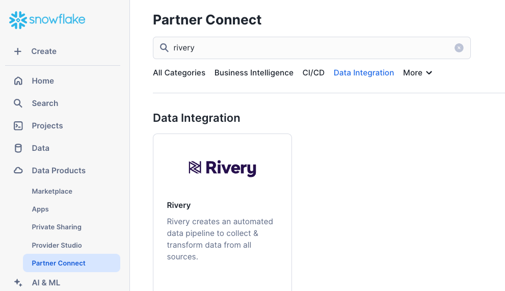 

Once you select Rivery, you’ll be prompted with a “Connect to Rivery” screen that contains your Snowflake database, warehouse, system credentials, and system role. Hit `Connect and activate` to launch the Rivery console in your browser. Within Rivery, you will be prompted to enter a password to use with Rivery and to create your account. This will set up both your Rivery account and Snowflake Target connection within Rivery ensuring you are ready to skip to the next step.

***If you’ve utilized Snowflake’s Partner Connect to create your Rivery account you can skip to Step 3.***

> aside positive
>
> If you’d like to set up a Rivery account separately, you can do so by navigating to Rivery’s [website](https://rivery.io/) and clicking [‘Start for Free’](https://rivery.io/free-trial/). You can also use [this link](https://docs.rivery.io/docs/setting-up-a-rivery-account) to find more information. You can now configure your Snowflake connection in Rivery. This will be needed later on as we point your paid Ads data (our Sources) into Snowflake (our Target). Navigate to your [Rivery account](https://console.rivery.io/). From here, you can go to Connections > New Connection > Snowflake, fill in the connection details, and test the connection. More information can be found [here](https://docs.rivery.io/docs/snowflake-as-a-target).

 

<!-- ------------------------ -->

## Setup the Target Database and Schemas
Duration: 5

Create a dedicated Snowflake database and schemas (for the marketing channels) to use for this Quickstart lab and make sure the Rivery Role which is auto created by Partner Connect has the permissions to use this database and Schemas (if you are not using Partner Connect, please adjust the below to use your own Role name). To do so, simply open a new SQL worksheet under the Snowflake console project menu and run the following SQL query in the Snowflake console (make sure you select `Run All`):

```sql
begin;

  /* switch to the sysadmin role which has privileges to create databases in an account. */
    USE ROLE sysadmin;
    
  /* Create database and schemas for marketing data, this step is optional */  
    CREATE DATABASE MARKETING_QUICKSTART;
    USE DATABASE MARKETING_QUICKSTART;
    
    CREATE SCHEMA FACEBOOK_ADS;
    CREATE SCHEMA GOOGLE_ADS;
    CREATE SCHEMA BING_ADS;
    CREATE SCHEMA LINKEDIN_ADS;
    CREATE SCHEMA X_ADS;
    CREATE SCHEMA DIGITAL_AD_ANALYTICS;
   
  /* grant the Rivery Role access to database */
   grant CREATE SCHEMA, MONITOR, USAGE
   on database MARKETING_QUICKSTART
   to role PC_RIVERY_ROLE;

  /* Grant access to all existing sachems on the database */
   grant ALL on all SCHEMAS IN DATABASE MARKETING_QUICKSTART to ROLE PC_RIVERY_ROLE;

commit; 
```
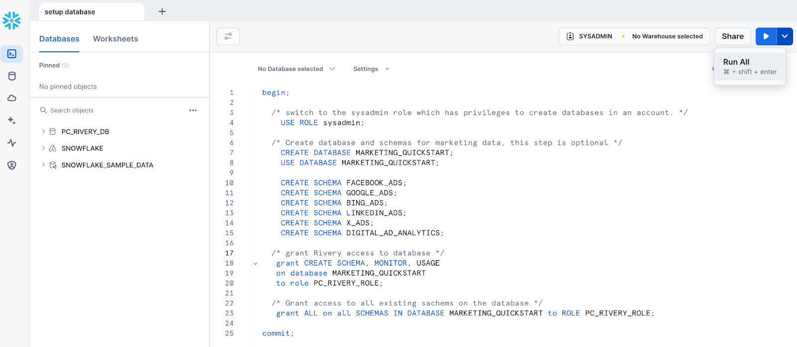

<!-- ------------------------ -->

## Use the Rivery Paid Ads to Snowflake kit
Duration: 10

Navigate to the kits marketplace by hitting `Kits` from the left navigation menu. 

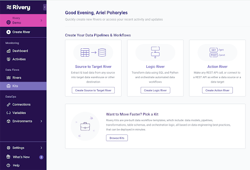
  
If you currently don’t have accounts for Google Ads, Bing Ads, Facebook Ads, LinkedIn Ads, and X Ads to be used with this lab, search for the « B2B Paid Ads Campaigns Performance - with Sample Data » and open it by clicking on the `Preview` button. If you do have those accounts, preview the same kit which isn’t the Quickstart Lab edition.  

Here you review the kit details including the required configuration steps and expected data model.

 

Hit the `Use Kit` button on the top right and set your connections:

 

Assuming you are using the Quickstart lab kit, instead of seeing the connections for the different Ads sources you will only see one connection for a PostgreSQL database. This database holds the sample data to be used for this lab. Hit the `Add new +` button and enter the details of the sample database dedicated to this lab:

```text
Connection Name: Public Postgres Demo Instance
Host: rds-pg-snowflake-lab-demo-us-east-2.cyaie4xhe0v4.us-east-2.rds.amazonaws.com
Port: 5432 (default value)
Database: demoSnowflakeLab
Username: snowflake
Password: Sn0wflakeQuickstart$
Disconnect handling: Optimistic (default value)
```

 

More information on connecting to a PostgreSQL database can be found on the right side of the screen as well as [here](https://docs.rivery.io/docs/create-a-connection).  

> aside positive
>
> Rivery offers a few different methods to ensure a secured connection to databases including SSH, Reverse SSH, VPN, AWS PrivateLink, and Azure Private Link but for the since this database is used to store the sample data, we will skip those in this lab. If you would like to connect to your own databases later, you may want to use [one of the methods](https://docs.rivery.io/docs/security) mentioned above per your organization's preferences. 

For Snowflake, choose your existing connection (created in step 2) using the drop-down list. 

Once you set your connections, hit the `Next` button and your kit will be on it’s way (all the pipelines will be imported to your Rivery account).

<!-- ------------------------ -->

## Set your variables and run the data workflow 
Duration: 10

Once your kit is added successfully, hit the `View Rivers` button. You will see all the Rivers (pipelines) of the kit:

### Variables Setup

In this kit, there are variables that are used to make for dynamic Target configuration. `{DATABASE_MARKETING}` is used in all Target configurations and queries as the target database name. For Target schemas, there are 6 variables to configure, one for each Source, and one schema for the final fact table created. Go to the `Variables` menu on the left side navigation bar and create variables for all of the above by hitting the `Add Variable` button. When creating each variable, fill in the values as the Snowflake database and schema(s) where you would like the data to land. If you used the script specified in the prerequisites section, you should use the following values:

<table border="1">
    <thead>
        <tr>
            <th style="background-color: #d3d3d3;"><strong>Variable Name</strong></th>
            <th style="background-color: #d3d3d3;"><strong>Value</strong></th>
        </tr>
    </thead>
    <tbody>
        <tr>
            <td>DATABASE_MARKETING</td>
            <td>MARKETING_QUICKSTART</td>
        </tr>
        <tr>
            <td>SCHEMA_MARKETING</td>
            <td>DIGITAL_AD_ANALYTICS</td>
        </tr>
        <tr>
            <td>SCHEMA_FACEBOOK</td>
            <td>FACEBOOK_ADS</td>
        </tr>
        <tr>
            <td>SCHEMA_LINKEDIN</td>
            <td>LINKEDIN_ADS</td>
        </tr>
        <tr>
            <td>SCHEMA_X</td>
            <td>X_ADS</td>
        </tr>
        <tr>
            <td>SCHEMA_BING</td>
            <td>BING_ADS</td>
        </tr>
        <tr>
            <td>SCHEMA_GOOGLE</td>
            <td>GOOGLE_ADS</td>
        </tr>
    </tbody>
</table>


Once completed, your Variables menu should look like this:

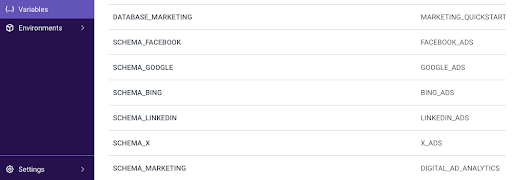 

### Run the data workflow

Open the **Master Logic - Build All Channels Fact Table river**. This is the main data pipeline that orchestrates the entire workflow. Hit the `Run` button to execute it. 

 

Running this workflow triggers the ingestion data pipelines that pulling data from the different Ad channels into your Snowflake database. Once in ingestion is done and all the data is in your Snowflake database, the last step of the workflow is to execute an in-database SQL query to model the data and unify it into a single table.  

You can monitor the execution result and make sure your River run was successful under the **Activities** menu available from the right hand side menu. 

> aside positive
>
> When using your real data, you can also modify the list of channel to ingest by toggling on and off the specific channels ingestion step as well as modifying the final step SQL query to comment out the channels that are not relevant. Once executed successfully, you would also want to schedule the workflow under the Settings tab. 
 
<!-- ------------------------ -->

## Set up a Snowflake dashboard and analyze the data
Duration: 10  

Once you successfully run the main river, your data should be available in Snowflake under the All_Channels_Fact_Table table located under the DIGITAL_AD_ANALYTICS schema within the MARKETING_QUICKSTART database. 

You can now create a Snowsight dashboard to compare the channels' performance using data from this table. 

Click the `Dashboards` item in the left navbar. This will display the Dashboard UI. Click `+ Dashboard` in the upper right to begin the dashboard creation process. You can name it as you wish - for example: “Marketing Paid Ads Analytics”.

 

### Filters Setup

Before you create tiles (visuals), let's create filters to be used across the dashboard tiles. Click on the `Filters` icon on the top left:

 

### Filter 1: Channel 

Within the filters menu, click on the + Filter on the top right and fill in the filter details: 

- Display Name: Channel
- SQL Keyword: :channel
- Description: filter by channel

Set the Role and Warehouse of choice and hit the `Write Query` button. On the next screen, enter the following SQL query:

```sql
select distinct CHANNEL from MARKETING_QUICKSTART.DIGITAL_AD_ANALYTICS.ALL_CHANNELS_FACT_TABLE
```
 

Run the query using the blue Play button on the top right and go back to the filter setting screen by hitting the `Done` label on the top left. 

Scroll down and make sure to toggle the option to allow “Multiple values can be selected” as well as “Include an “All” option”.

Once done your filter should look like this: 

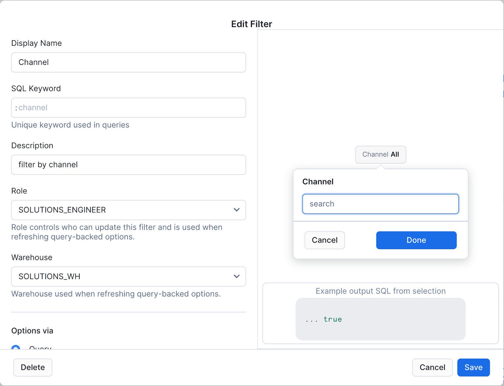 


### Filter 2: Channel Type

Create another filter with the same settings except for:

- Display Name: Channel Type
- SQL Keyword: :channeltype
- Description: filter by channel type

SQL Query: 

```sql
select distinct channel_type from MARKETING_QUICKSTART.DIGITAL_AD_ANALYTICS.ALL_CHANNELS_FACT_TABLE
```

The end result should show 4 filters (including the default **datebucket** and **daterange**):

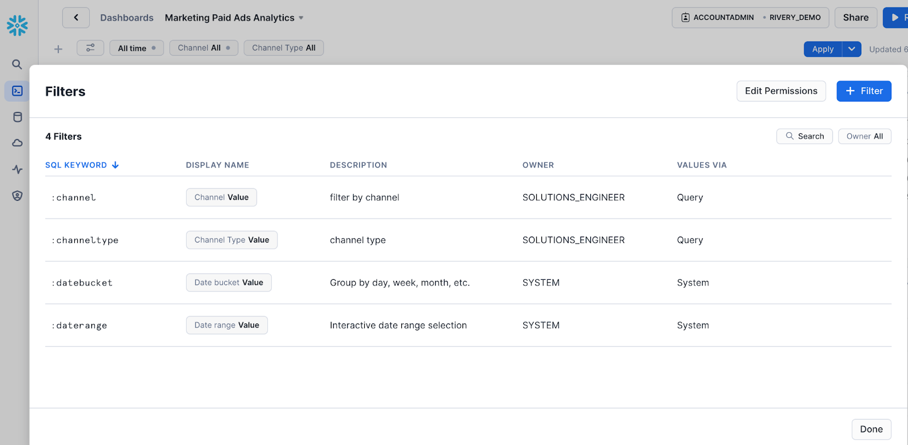 

### Tiles Setup

Tiles represent dashboard objects, and each tile represents a separate execution of SQL and visualization in the dashboard. Below is the process that can be followed for all tiles in this lab:

1. On the top left, click on the `+` menu, `New Tile` and choose `From SQL Worksheet`.
2. Copy and paste the SQL for each tile into the SQL section in the tile worksheet.
3. Click the `Play` button and ensure you are receiving results. Always select the database and schemas or use a full path in SQL for database.schema.table/view. In addition, make sure the date range filter is set to “All time” instead of “Last day”.
4. Set tile name and enable the chart display by clicking the Chart button (except where a table is to be rendered like Tile #5).
5. To get the tiles to look like the ones in this lab, simply apply the metadata in the Chart Type section (except for Tile #4) on the right side of the UI to match the image in each tile section below.

Once all the tiles are created, you may move them around on the dashboard to your liking.

### Tile 1: Impressions

```sql
select
    CHANNEL,
    sum(impressions) as Impressions
from
    MARKETING_QUICKSTART.DIGITAL_AD_ANALYTICS.ALL_CHANNELS_FACT_TABLE
where
    channel = :channel
    and date = :daterange
    and channel_type = :channeltype
group by
    (CHANNEL)

```

 

### Tile 2: Clicks

```sql
select
    CHANNEL,
    sum(clicks) as Clicks
from
    MARKETING_QUICKSTART.DIGITAL_AD_ANALYTICS.ALL_CHANNELS_FACT_TABLE
where
    channel = :channel
    and date = :daterange
    and channel_type = :channeltype
group by
    (CHANNEL)
```

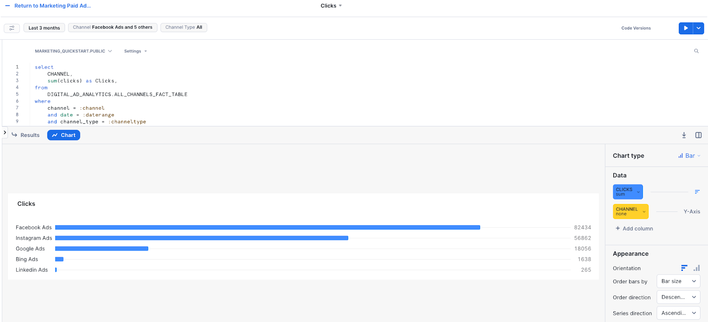 

### Tile 3: Spend

```sql
select
    CHANNEL,
    Round(sum(spend)) as Spend
from
    MARKETING_QUICKSTART.DIGITAL_AD_ANALYTICS.ALL_CHANNELS_FACT_TABLE
where
    channel = :channel
    and date = :daterange
    and channel_type = :channeltype
group by
    (CHANNEL)
```

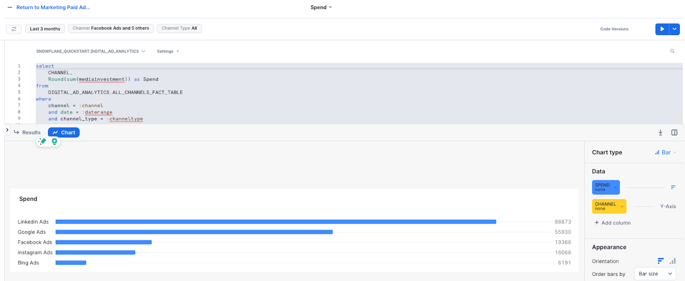 

### Tile 4: Clicks by Channel over time

```sql
select
    CHANNEL,
    sum(clicks) as Clicks,
    DATE 
from
    MARKETING_QUICKSTART.DIGITAL_AD_ANALYTICS.ALL_CHANNELS_FACT_TABLE
where
    channel = :channel
    and date = :daterange
    and channel_type = :channeltype
group by
    (CHANNEL, DATE)
```
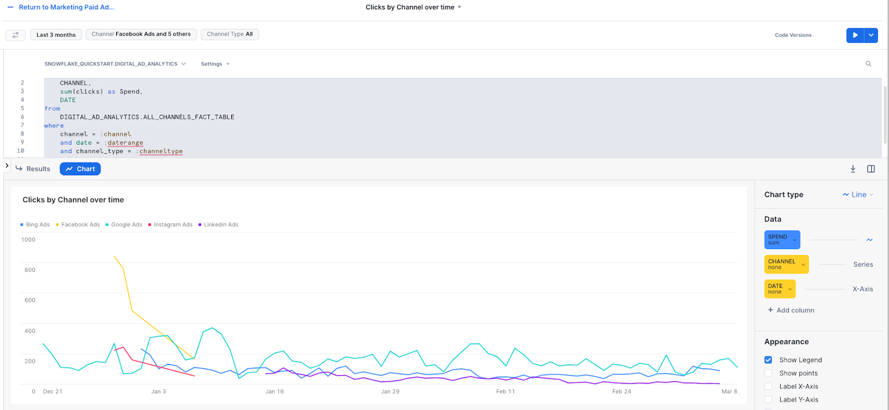 


### Tile 5: Campaign Results

```sql
select
    channel_type,
    CHANNEL,
    CAMPAIGN,
    sum(impressions) as Impressions,
    sum(clicks) as Clicks,
    sum(spend) as Spend    
from
    MARKETING_QUICKSTART.DIGITAL_AD_ANALYTICS.ALL_CHANNELS_FACT_TABLE
where
    channel = :channel
    and date = :daterange
    and channel_type = :channeltype
group by
    (CHANNEL, CAMPAIGN, channel_type)
    order by CHANNEL_TYPE asc
```

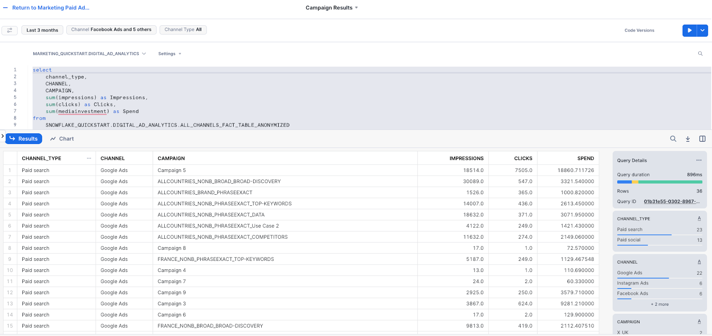 

### Final Dashboard Layout

With all the tiles created, you can control your visual layout. Here is an example of a suggested layout. Now, you can start using the filters and easily compare campaign performance across channels:

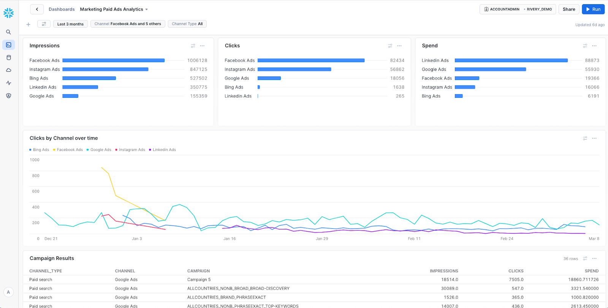 


## Conculsion
Duration: 2

Congratulations! You’ve now configured a complete data analytics solution for your paid Ads using Rivery and Snowflake data migration pipeline. 

We would love your feedback on this QuickStart Guide! Please submit your feedback using this [Feedback](https://docs.google.com/forms/d/e/1FAIpQLSe-M5JN42SrV3s5cH3CbwTDGHVT1pKpB0KV63OJcyVpv3GR6Q/viewform?usp=sf_link) Form.

### What You Learned

- How to use Snowflake partner connect to launch a Rivery account
- How to connect to your different data sources using Rivery
- How to use a Rivery kit to set a complete data integration solution with source to target pipelines and data transformations to load data into Snowflake and model it
- How to visually analyze the modeled data using a Snowflake Snowsight dashboard to get valuable insights into your paid Ads performance across all Ads channels.
- How to setup an Ads data model foundation that can be further augmented with data from your CRM and other operational system for deeper insights using Rivery and Snowflake.

Want to to learn more? Get up to speed on other [Rivery and Snowflake integrations](https://rivery.io/partners-snowflake/) to simplify your data delivery.  

<!-- ------------------------ -->