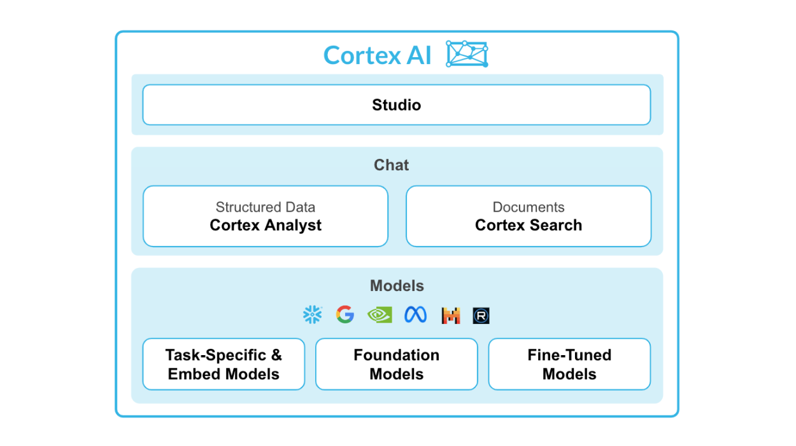
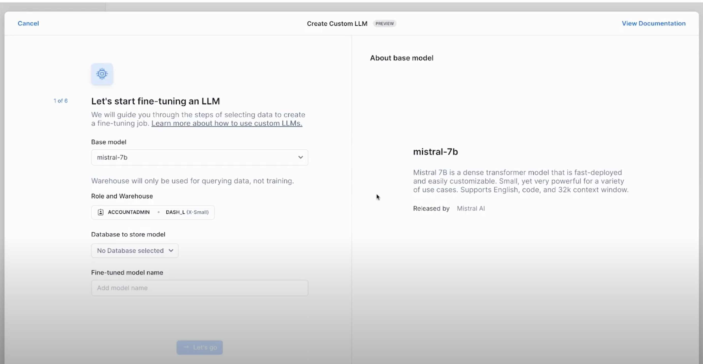

id: finetuning_llm_using_snowflake_cortex_ai
summary: This guide provides the instructions for fine-tuning large language models using Snowflake Cortex AI.
categories: featured,getting-started,cortex
environments: web
status: Published
feedback link: <https://github.com/Snowflake-Labs/sfguides/issues>
tags: Getting Started, Snowflake Cortex, Streamlit
authors: Vino Duraisamy

# Serverless LLM Fine-tuning using Snowflake Cortex AI
<!-- ------------------------ -->
## Overview

Duration: 5

Getting started with AI on enterprise data can seem overwhelming. Between getting familiar with LLMs, how to perform custom prompt engineering, fine-tuning an existing foundation model and how to get a wide range of LLMs deployed/integrated to run multiple tests all while keeping that valuable enterprise data secure. Well, a lot of these complexities are being abstracted away for you in Snowflake Cortex AI.

### What is Snowflake Cortex?

Snowflake Cortex is an intelligent, fully managed service that provides access to industry-leading large language models (LLMs) and chat with your data services.. Cortex AI capabilities include:



**Models**: Access to tasks specific functions such as sentiment analysis, translation as well as Foundation Models from Snowflake, Meta, Mistral AI. Leading models from Meta and Mistral AI are available for serverless fine-tuning (public preview). 

**Chat Services**:  Ask questions against unstructured data, such as documents using Cortex Search or ask questions to structured data, such as sales transactions using Cortex Analyst - both coming soon to public preview. 

**AI & ML Studio**: This a no-code development workspace in Snowflake. Specifically for LLMs, Studio lets users quickly try out models, easily fine-tune models, and set up use cases such as search so you can expedite delivery of applications.

In this quickstart, we will go through 2 flows – Use Cortex AI to fine-tune an LLM to categorize customer support tickets for a Telecom provider, and generate custom email/text communications tailored to each customer ticket.

Learn more about [Snowflake Cortex](https://docs.snowflake.com/en/user-guide/snowflake-cortex/overview).

### Fine-tuning for Enterprise Use-cases

Compared to a smaller size model such as Mistral 7B, a foundation large language model such as `mistral-large` can be used to categorize support tickets with higher accuracy. But using a large language model comes with higher inference costs. 

Using fine-tuning, organizations can make smaller models really good at specific tasks to deliver results with the accuracy of larger models at just a fraction of the cost.

### What You Will Learn

By the end of this quickstart guide, you will be able to use Snowflake Cortex AI to:
**Categorize**: Use LLM to categorize support tickets
**Generate**: Prepare training dataset for fine-tuning by leveraging an LLM for annotations
**Fine-tune**: Use smaller, fine-tune model to achieve accuracy of larger model at fraction of cost
**Generate**: Custom email/text communications tailored to each support ticket

### Prerequisites

- A [Snowflake](https://signup.snowflake.com/) account in a region where Snowflake Cortex is available. [Check availability](https://docs.snowflake.com/en/user-guide/snowflake-cortex/llm-functions#label-cortex-llm-availability).
- A Snowflake user created with ACCOUNTADMIN permissions. This user will be used to get things setup in Snowflake.
> aside positive
> Note: Cortex Fine-tuning is not available in Snowflake Free Trial accounts. Use your own accounts or reach out to your account representative to use this in your account.

- A GitHub account. If you don't already have a GitHub account you can create one for free. Visit the [Join GitHub](https://github.com/signup) page to get started. 
- Download the Snowflake Notebook from [this Git repository](https://github.com/Snowflake-Labs/snowflake-demo-notebooks) for fine-tuning the model.

<!-- ------------------------ -->
## Setup

Duration: 5

### Load the Demo Notebook

A Snowflake Notebook with the required code snippets for this quickstart are available in [this](https://github.com/Snowflake-Labs/snowflake-demo-notebooks) repository. 

To load the demo notebook into your Snowflake account, follow these steps:

- Download the file by clicking on the `Download raw file` from the top right.
- Go to the Snowflake web interface, Snowsight, on your browser.
- Navigate to `Project` > `Notebooks` from the left menu bar.
- Import the `.ipynb` file you've downloaded into your Snowflake Notebook by using the `Import from .ipynb` button located on the top right of the Notebooks page.

### Create Table and Load Data

Run these SQL statements in a SQL worksheet to create `support_tickets` table and load data. 

```sql
CREATE or REPLACE file format csvformat
  SKIP_HEADER = 1
  FIELD_OPTIONALLY_ENCLOSED_BY = '"'
  type = 'CSV';

CREATE or REPLACE stage support_tickets_data_stage
  file_format = csvformat
  url = 's3://sfquickstarts/support_tickets/';

CREATE or REPLACE table SUPPORT_TICKETS ( 
  ticket_id varchar(10),
  customer_name varchar(30),
  customer_email varchar(60),
  service_type varchar(60),
  request varchar(1000),
  contact_preference varchar(10)
);

COPY into CALL_TRANSCRIPTS
  from @support_tickets_data_stage;
```

<!-- ------------------------ -->
## Fine-tuning LLMs using Snowflake Cortex AI

Duration: 10

### Support Ticket Categorization using Cortex AI

First, let's use Snowflake Cortex `COMPLETE()` to categorize the support tickets into different buckets – Roaming Fees, Slow data speed, Add new line, Closing account and more.

We can use any Cortex supported model under the hood to invoke the `COMPLETE()` function. In this quickstart, let’s use `mistral-large` and use the following prompt.

```python
prompt = """You are an agent that helps organize requests that come to our support team. 

The request category is the reason why the customer reached out. These are the possible types of request categories:

Roaming fees
Slow data speed
Lost phone
Add new line
Closing account

Try doing it for this request and return only the request category only.
"""
```

Using a powerful and large language model such as `mistral-large` might be highly accurate without doing any complex customizations but running `mistral-large` on millions of support tickets comes with a cost. So, let’s try the same COMPLETE() function with the same prompt but this time with a smaller model such as `mistral-7b`. 

As we can see, the smaller model `mistral-7b` does not generate results with a consistent structure.

To overcome this, we could fine-tune `mistral-7b` particularly for this task. This fine-tuned model will be smaller in size and the inference cost is only a fraction of what a larger model would cost. 

### Fine-tuning

To fine-tune the language model, we need training data that includes support ticket requests and right category labels for each of them. Annotations for millions of support tickets are not readily available. So we could leverage an existing large language model to create category labels and prepare the dataset for fine-tuning.

Next step is to split the curated dataset into a training and a test set. Once we have the training data, we could use Snowflake Cortex AI Studio to fine-tune. Cortex AI features a no-code fine-tuning from the UI using the `Create Custom LLM` option.



- In the wizard that appears, select the base model for fine-tuning. In this case, `mistral-7b`. 
- Select the appropriate role and warehouse for model fine-tuning.
- Select the right database to store the fine-tuned model as well.
- Select the training data including the prompt column, and complete column
- In the end, select the validation data for Cortex to evaluate the fine-tuning process too
- Inferencing the fine-tuned model

Once the fine-tuning is complete, we could run inference on the model by simply invoking the Cortex AI `COMPLETE()` with the fine-tuned model name as one of the parameters.

### Automated Generation of Email Responses to support tickets using LLMs

After categorizing the support tickets into different categories based on the reason for the support request, we can also use Cortex AI to auto-generate the email/text responses to these support requests.

The following code snippet creates a nimble steamlit application in a Snowflake Notebook that you can use to iterate through the different prompts while invoking the Complete() function.

```python
st.subheader("Auto-generate custom emails or text messages")

with st.container():
    with st.expander("Edit prompt and select LLM", expanded=True):
        entered_prompt = st.text_area('Prompt',"""Please write an email or text promoting a new plan that will save customers total costs. If the customer requested to be contacted by text message, write text message response in less than 25 words, otherwise write email response in maximum 100 words.""")
    
        with st.container():
            left_col,right_col = st.columns(2)
            with left_col:
                selected_category = st.selectbox('Select category',('Roaming fees', 'Closing account', 'Add new line', 'Slow data speed'))
            with right_col:
                selected_llm = st.selectbox('Select LLM',('snowflake-arctic','llama3-8b','mistral-large', 'reka-flash',))

with st.container():
    _,mid_col,_ = st.columns([.4,.3,.3])
    with mid_col:
        generate_template = st.button('Generate messages ⚡',type="primary")

with st.container():
    if generate_template:
        sql = f"""select s.ticket_id, s.customer_name, concat(IFF(s.contact_preference = 'Email', '📩', '📲'), ' ', s.contact_preference) as contact_preference, snowflake.cortex.complete('{selected_llm}',
        concat('{entered_prompt}','Here is the customer information: Name: ',customer_name,', Contact preference: ', contact_preference))
        as llm_response from support_tickets as s join support_tickets_train as t on s.ticket_id = t.ticket_id
        where t.mistral_large_response = '{selected_category}' limit 10"""

        with st.status("In progress...") as status:
            df_llm_response = session.sql(sql).to_pandas()
            st.subheader("LLM-generated emails and text messages")
            for row in df_llm_response.itertuples():
                status.caption(f"Ticket ID: `{row.TICKET_ID}`")
                status.caption(f"To: {row.CUSTOMER_NAME}")
                status.caption(f"Contact through: {row.CONTACT_PREFERENCE}")
                status.markdown(row.LLM_RESPONSE.replace("--", ""))
                status.divider()
            status.update(label="Done!", state="complete", expanded=True)

```

Depending on the values in the `contact_preference` column, Cortex AI can generate text or email messages that can be used for customer support responses.

<!-- ------------------------ -->
## Conclusion And Resources

Duration: 1

Congratulations! You've successfully completed the Cortex Fine-tuning Quickstart Guide. You can use any of [these](https://docs.snowflake.com/en/user-guide/snowflake-cortex/llm-functions?_fsi=TNKw8Mx5&_fsi=TNKw8Mx5#availability) supported LLMs for fine-tuning with Cortex.


### What You Learned

You have learnt how to use Snowflake Cortex AI to:
**Categorize**: Use LLM to categorize support tickets
**Generate**: Prepare training dataset for fine-tuning by leveraging an LLM for annotations
**Fine-tune**: Use smaller, fine-tune model to achieve accuracy of larger model at fraction of cost
**Generate**: Custom email/text communications tailored to each support ticket

### Related Resources

- [Snowflake Cortex: Overview](https://docs.snowflake.com/en/user-guide/snowflake-cortex/overview)
- [Snowflake Cortex: LLM Functions](https://docs.snowflake.com/user-guide/snowflake-cortex/llm-functions)
- [Snowflake Cortex: COMPLETE()](https://docs.snowflake.com/user-guide/snowflake-cortex/llm-functions#label-cortex-llm-complete)
- [Snowflake Notebooks: Demo Repository](https://github.com/Snowflake-Labs/snowflake-demo-notebooks)
